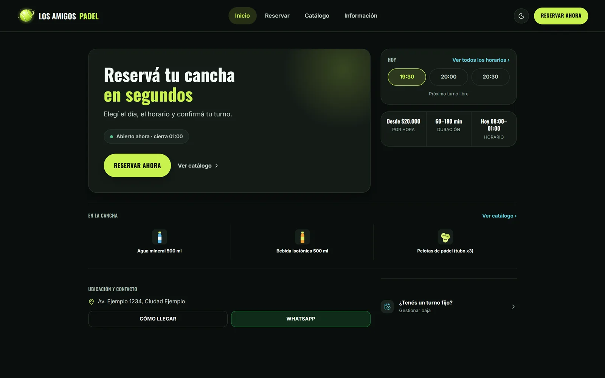
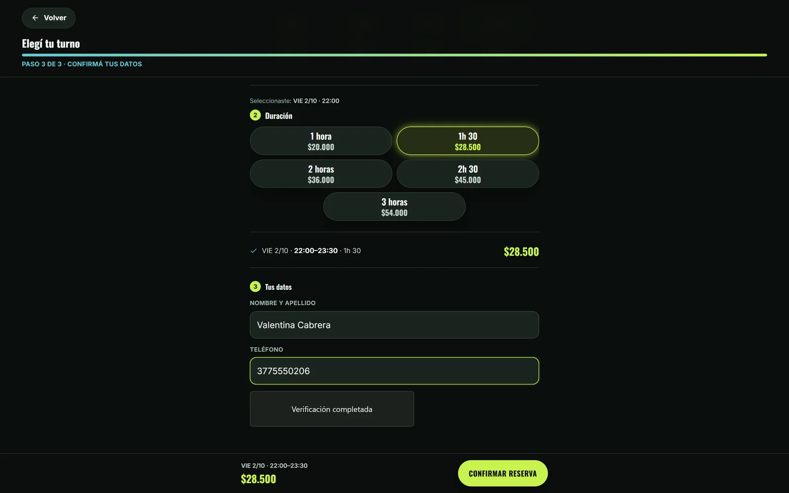
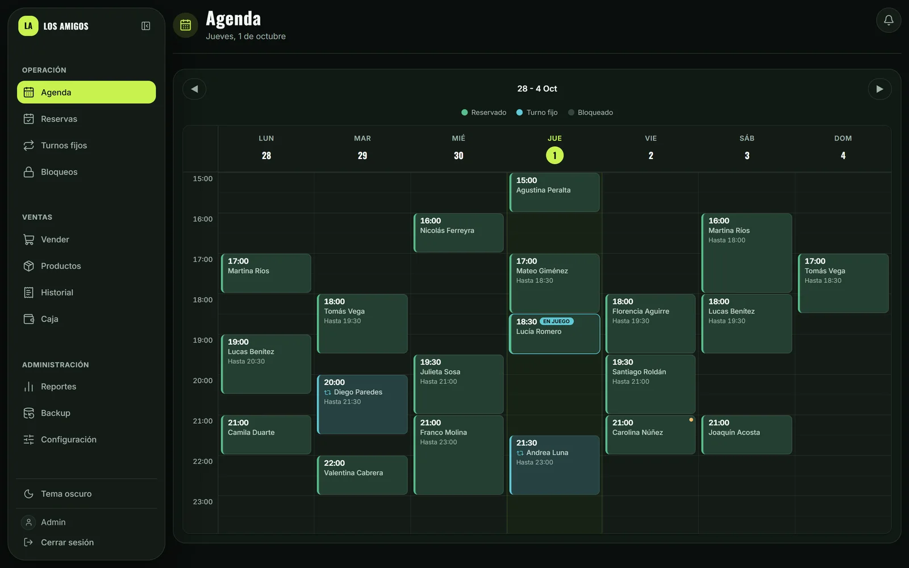
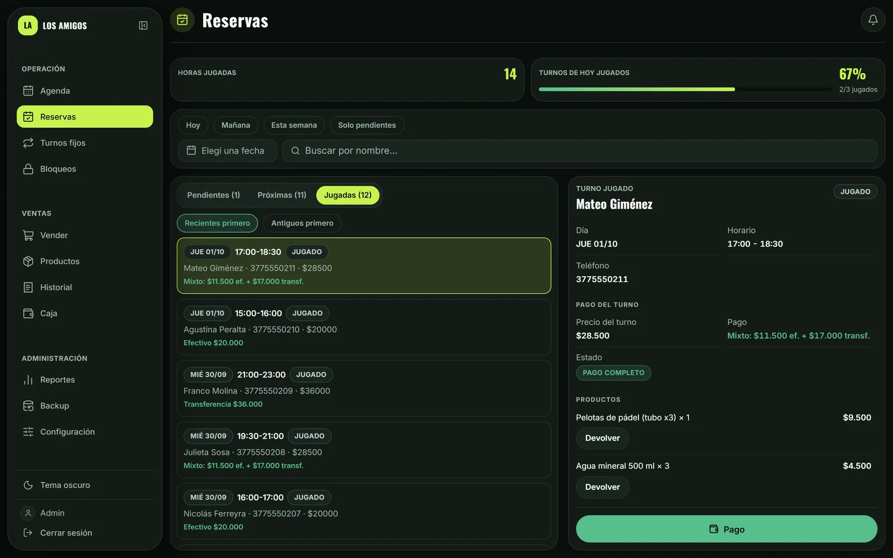
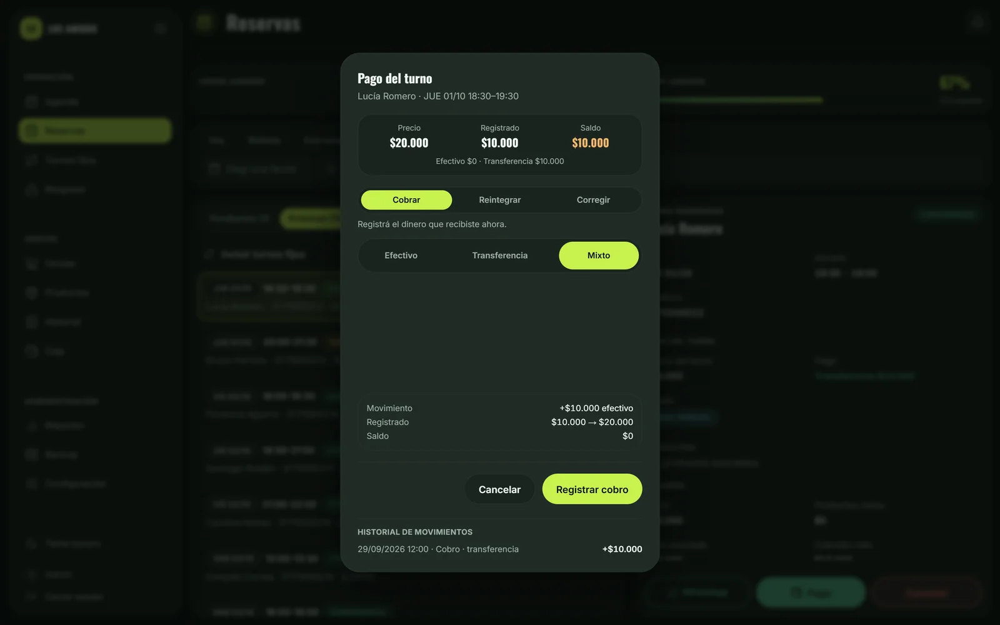
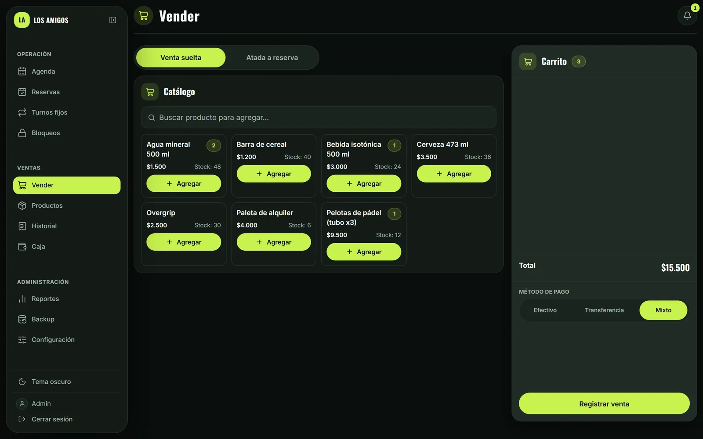
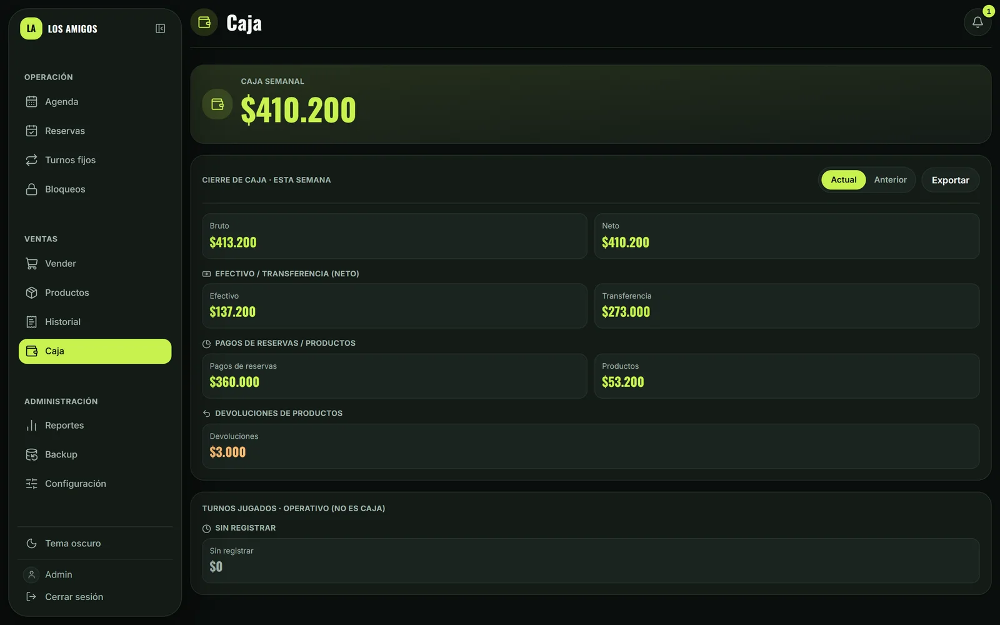
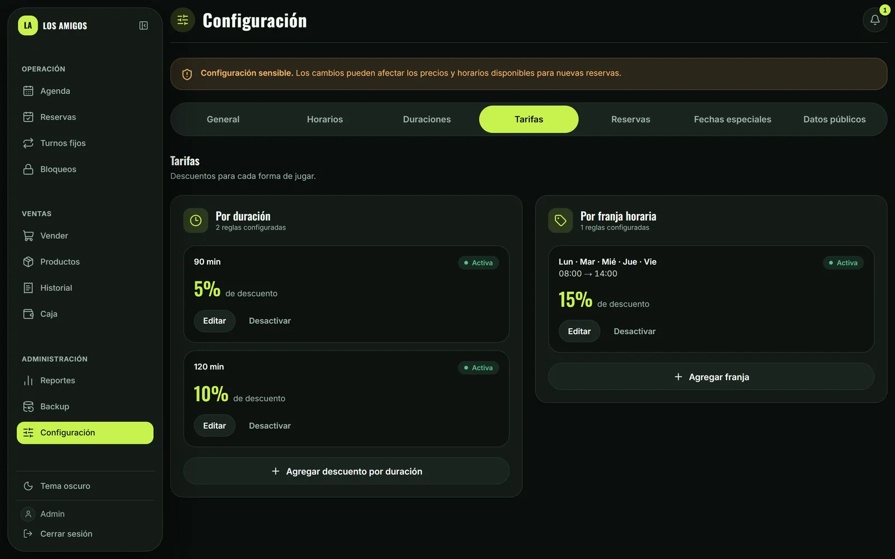

<div align="center">

# LOS AMIGOS PADEL

**Sistema de reservas, administración y gestión para una cancha de pádel.**

<p>
<a href="https://react.dev"></a>
<a href="https://www.typescriptlang.org"></a>
<a href="https://vite.dev"></a>
<a href="https://tailwindcss.com"></a>
</p>
<p>
<a href="https://supabase.com"></a>
<a href="https://pages.cloudflare.com"></a>
<a href="https://vitest.dev"></a>
<a href="./LICENSE"></a>
</p>

🌐 **[Ver sitio en producción](https://losamigospadel.site)**

Reservas online, turnos fijos, pagos, productos, caja y administración en una sola aplicación.

</div>

---

## 🎾 Descripción

Aplicación de reservas online para una cancha de pádel, con panel de administración completo: agenda, turnos fijos, ventas de productos, caja y configuración de tarifas y horarios. La reserva pública corre sin login detrás de un gateway con verificación humana; el panel de administración corre sobre Supabase Auth y Row Level Security.

Es un proyecto real en producción, no un demo: este repositorio es un snapshot sanitizado del código para portfolio, sin datos ni credenciales del sistema productivo.

## 📸 Capturas

<div align="center">

<table>
<tr>
<td align="center" width="50%">
<br>
<sub>Home pública</sub>
</td>
<td align="center" width="50%">
<br>
<sub>Flujo de reserva</sub>
</td>
</tr>
<tr>
<td align="center" width="50%">
<br>
<sub>Agenda del admin</sub>
</td>
<td align="center" width="50%">
<br>
<sub>Detalle de reserva</sub>
</td>
</tr>
<tr>
<td align="center" width="50%">
<br>
<sub>Registro de pago mixto</sub>
</td>
<td align="center" width="50%">
<br>
<sub>Venta de productos</sub>
</td>
</tr>
<tr>
<td align="center" width="50%">
<br>
<sub>Cierre de caja semanal</sub>
</td>
<td align="center" width="50%">
<br>
<sub>Configuración de tarifas</sub>
</td>
</tr>
</table>

*Datos de prueba, ficticios. Ver [`docs/screenshots/`](./docs/screenshots/).*

</div>

## ✨ Funcionalidades

**Público** — reserva en 3 pasos con disponibilidad y precio en tiempo real, catálogo de productos, autogestión de turnos fijos (cancelar una ocurrencia sin llamar al club).

**Administración** — agenda semanal, búsqueda y detalle de reservas, ventas sueltas o atadas a una reserva, caja con desglose por medio de pago, alta de turnos fijos con múltiples horarios en una operación atómica, configuración de horarios operativos, duraciones, tarifas por franja/duración y fechas especiales.

**Turnos fijos** — recurrencia semanal con excepciones puntuales, materialización automática de las ocurrencias jugadas, enlace de autogestión por titular.

## 🧱 Arquitectura

<div align="center">

</div>

La reserva pública pasa por Cloudflare Turnstile y un gateway con clave compartida antes de tocar la base de datos; el panel de administración entra directo por Supabase Auth bajo Row Level Security. Detalle completo en [`docs/ARCHITECTURE.md`](docs/ARCHITECTURE.md).

## 🛠️ Stack

React 19 · TypeScript 5.7 · Vite 8 · Tailwind CSS 4 · Supabase (PostgreSQL, Auth, Realtime, Storage) · Cloudflare Pages + Pages Functions · Vitest

## 🔐 Seguridad

- **Reserva pública gateada**: Turnstile + gateway con clave compartida y rate limit antes de cualquier escritura; `crear_reserva` no es invocable directamente por PostgREST.
- **RLS en todas las tablas operativas**: el rol anónimo solo ve vistas públicas explícitas y acotadas, nunca la tabla completa.
- **Funciones `SECURITY DEFINER`** con permisos revocados explícitamente donde no corresponden — `REVOKE ALL FROM PUBLIC` no alcanza si `anon`/`authenticated` siguen con acceso heredado.
- **Integridad a nivel de base**: exclusion constraint contra solapamiento de horarios, independiente de cualquier validación de cliente.
- **Idempotencia** en las operaciones que mueven dinero, para que un reintento de red nunca duplique un cobro.
- **CSP y cabeceras de seguridad** en el despliegue de Cloudflare Pages.

Más detalle en [`docs/database-design.md`](docs/database-design.md).

## 🧪 Testing

1625 tests (Vitest) sobre lógica de negocio, adaptadores de datos y componentes, más un arnés de tests funcionales contra PostgreSQL local para las funciones más sensibles (motor de precios, contabilidad, solapamientos).

```bash
npm test
```

## 📁 Estructura del proyecto

```
src/
  features/     una carpeta por área (reservas, turnos fijos, ventas, caja, configuración...)
  components/   componentes de UI compartidos
  lib/          utilidades puras (fechas, dinero, teléfonos, idempotencia)
  config/       configuración de la cancha
functions/       Pages Function /api/reservar (Turnstile + gateway)
public/          assets estáticos, cabeceras de seguridad
docs/            arquitectura, diseño de datos, capturas
```

## 🚀 Desarrollo local

```bash
npm install
cp .env.example .env   # completar con un proyecto Supabase propio
npm run dev
```

```bash
npm run typecheck   # tsc -b --noEmit
npm run build        # tsc -b && vite build
npm test              # vitest run
```

## Estado del proyecto

En producción. Este repositorio es un snapshot sanitizado con fines de portfolio: no incluye el esquema completo de base de datos, scripts operativos ni configuración de despliegue del proyecto real.

## 📚 Documentación

- [`docs/ARCHITECTURE.md`](docs/ARCHITECTURE.md) — arquitectura del sistema.
- [`docs/database-design.md`](docs/database-design.md) — dominios de datos, RLS, RPC, idempotencia y concurrencia.

## Licencia

Código visible con fines de portfolio y evaluación técnica. No se concede permiso de uso comercial, redistribución ni copia. Ver [`LICENSE`](./LICENSE).

## 👤 Autor

**elorrietadev** — [github.com/elorrietadev](https://github.com/elorrietadev)
