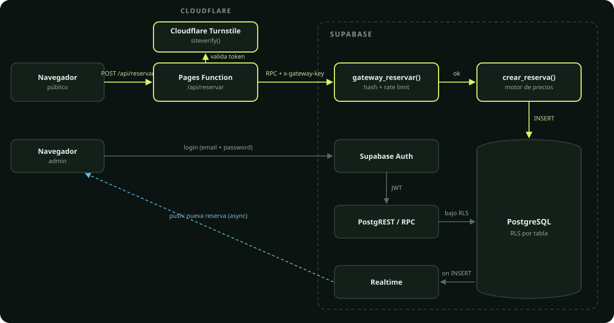

# Arquitectura

Vista de alto nivel del sistema. Para el modelo de datos ver [`database-design.md`](./database-design.md).

## Componentes

**Cloudflare Pages** sirve la SPA (React + Vite) y aloja una única Pages Function, `/api/reservar`, que es el único punto de entrada para crear una reserva desde el sitio público.

**Reserva pública** — el camino con más superficie de ataque, por eso es el más controlado:

1. El navegador resuelve un desafío de **Cloudflare Turnstile** y envía el token junto con los datos del turno a `/api/reservar`.
2. La Function valida `Origin`/forma del payload, verifica el token contra Turnstile (`siteverify`, comprobando hostname y `action`) y aplica un límite de intentos por IP (HMAC, nunca la IP en texto plano).
3. Recién ahí llama a `gateway_reservar` en Supabase, autenticada con la `anon key` más un header `x-gateway-key` cuyo hash vive en la base (nunca el secreto).
4. `gateway_reservar` valida ese hash, aplica su propio rate limit y delega en `crear_reserva`, la función que corre el motor de precios y hace las validaciones de negocio.
5. `crear_reserva` es la única vía de escritura en `reservas`: el `INSERT` directo por PostgREST está revocado para `anon`, `authenticated` y `service_role`.

**Administración** entra directo por **Supabase Auth** (email + contraseña) y consume **PostgREST**/RPC bajo Row Level Security: cada policy filtra por `is_admin()`, no hay una capa intermedia propia.

**Realtime** empuja un evento al panel de administración cuando se inserta una reserva nueva, para que la Agenda se actualice sin polling.

**Storage** guarda las imágenes del catálogo de productos en un bucket público de solo lectura; la escritura (subida/borrado) requiere sesión de administrador.

## Por qué un gateway y no RPC directa

Antes de este diseño, `crear_reserva` era invocable directamente por PostgREST con la `anon key`, que es pública por definición. Cualquiera con esa key podía llamar a la función sin pasar por Turnstile ni por el rate limit de la Function. El gateway cierra ese bypass: la única forma de llegar a `crear_reserva` desde el exterior es primero resolver el desafío humano y después presentar un secreto que solo conoce la Function.

## Motor de precios

El precio de una reserva no es un valor fijo: depende de la duración, la franja horaria, el día de la semana y posibles fechas especiales (feriados, promociones), con prioridad fecha especial > franja > duración > precio base. Esa prioridad vive en una única función (`calcular_precio_en_instante`), reutilizada tanto por la cotización que ve el usuario antes de confirmar como por `crear_reserva` al momento de escribir — nunca se recalcula ni se duplica en el cliente.

## Contabilidad

Los pagos no se guardan como un campo mutable en la reserva. Cada cobro, reintegro, corrección o devolución es un **movimiento** inmutable con su propio timestamp e idempotency key; el saldo de una reserva o el cierre de caja de una semana se calculan sumando esos movimientos, nunca leyendo un acumulador que alguien podría desincronizar.
